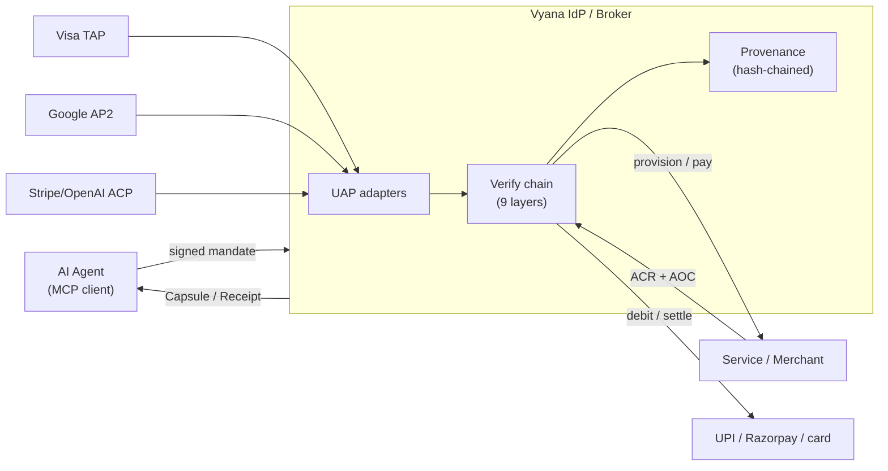

# Open Agent Commerce

> Open protocols and reference primitives that let AI agents **create accounts,
> authorize spend, receive credentials, and prove ownership** under signed,
> revocable user consent — with a tamper-evident provenance trail — and that
> **unify** the major agent-commerce rails (Visa TAP, Google AP2, Stripe/OpenAI
> ACP) behind one verification model.

[](./spec)
[-MIT-green)](./LICENSE-CODE)
[-CC%20BY%204.0-green)](./LICENSE-SPEC)

Stewarded by **Vyana** — published as an open standard, not owned. Comments,
issues, and implementations from any vendor are welcome.

**Open Agent Commerce is a suite of three components:**

| Component | What it does |
|---|---|
| **ASP** — Agent Signup Protocol | How an agent creates/connects an account and proves who owns it. |
| **Agent Payment** (AP2-aligned) | How an agent is authorized to spend, and how settlement is proven. |
| **Unified Agent Protocol** | A neutral layer that normalizes Visa TAP, Google AP2, Stripe/OpenAI ACP, and the above into one verifiable request. |

---

## The challenge

AI agents are starting to transact for people: signing up for services, paying,
managing subscriptions. But there is no neutral, verifiable way to answer:

- **Did the user actually authorize this agent to do this?** (authorization)
- **Is this a real, credentialed agent — not an anonymous bot?** (authenticity)
- **What exactly happened, and can it be proven later?** (accountability)
- **When the agent signs the user up somewhere, who owns that account?** (ownership)

Payment rails (ACP, AP2, Visa TAP, UPI) move money and verify identity. None of
them defines how an agent **creates and owns an account** in the first place, nor
emits a portable, signed record of *why* an action was allowed.

## The solution

Signature-first protocols plus framework-free reference primitives:

| Component | Question it answers | Core outputs |
|---|---|---|
| **Agent Signup Protocol** | Can this agent create/connect this merchant account, and who owns it? | `CredentialCapsule`, `AccountCreationReceipt`, `AccountOwnershipCertificate` |
| **Agent Payment** (AP2-aligned) | Can this agent spend this amount here, and did settlement happen? | `CartMandate`, `Receipt` |
| **Unified Agent Protocol** | Can a verifier evaluate a TAP / AP2 / ACP / Vyana request with one engine? | `UnifiedAuthorizationRequest` |

Signup and payment are bound to one **User Consent Mandate** (revocable) and one
**provenance chain**. Signup is deliberately scoped to account creation + initial
credential issuance; ongoing payment/settlement is AP2-aligned and rail-agnostic.

## Where this sits in the stack

```
  APP   Agent Payment Protocol   "can it spend? how is it settled?"  ── AP2/ACP-aligned
   ▲
   │ uses account/ownership proof from
   │
  ASP   Agent Signup Protocol    "how does the agent get the account?"  ◀── this repo
   ▲
   │ uses
   │
  MCP   Model Context Protocol    "how does an agent invoke tools?"
```

ASP/APP are **rail-agnostic**: the mandates and receipts verify the same way
whether settlement lands on UPI, cards, or a payment token. They're meant to be
*consumed alongside* TAP/AP2/ACP, not to replace them.

## Unified Agent Protocol (UAP)

The agent-commerce ecosystem is fragmenting across protocols. UAP is a **neutral
normalization layer**: adapters map **Visa TAP**, **Google AP2**, **Stripe/OpenAI
ACP**, and **Vyana ASP/APP** into one canonical `UnifiedAuthorizationRequest`, so
a verifier evaluates any of them with **one policy engine** and emits **one
provenance record**.

```ts
import { fromVisaTap, fromAp2, fromAcp, fromVyana } from "@vyana/open-agent-commerce";

const req = fromVisaTap({ agentId, keyId, algorithm, signature, par, amountMinor, currency });
// → { identity, authorization, instrument, sources: ["visa-tap"], … }
// hand `req` to one verify chain, regardless of which protocol it arrived on.
```

UAP **does not replace or claim ownership** of TAP/AP2/ACP — those are owned by
Visa/Google/Stripe. It normalizes their *shape* and leaves *verification* (RFC
9421, VDC proofs, token validation, Ed25519) to the verifier. Spec:
[`spec/UAP-0.1.md`](./spec/UAP-0.1.md) · demo:
[`examples/unify-protocols.ts`](./examples/unify-protocols.ts).

## How it works

Full set of sequence + architecture diagrams: **[`docs/SEQUENCES.md`](./docs/SEQUENCES.md)**
(UCM consent · native signup · cold-start signup · payment + settlement · the
verify chain · unified UAP verification · ownership recovery). Architecture at a
glance:



## Core objects

| Object | What it is |
|---|---|
| **User Consent Mandate (UCM)** | Long-lived, user-signed authorization that bounds an agent: allowed categories, spend caps, validity. KYC level × authenticator tier bound the caps. |
| **Signup Mandate** | Per-signup, user-signed: *"I authorize agent X to create me an account at service Y under these conditions."* |
| **Signup Strategy** | The legitimate signup mechanisms: `native-asp`, `oauth-app`, `cli-session-reuse`, `paste-token`, `browser-automation`. The IdP picks the highest-trust one a service supports — so agents can onboard users at services that have **not** integrated ASP. |
| **Credential Capsule** | The signup result: encrypted credentials + provenance link, plus a service-signed **ACR** (creation receipt) and **AOC** (ownership certificate) on the `native-asp` path. |
| **Account Ownership Certificate (AOC)** | The user's safety net — a direct-claim path to take over the account even if the IdP disappears. |
| **Cart Mandate** | User-signed authorization to pay a merchant (AP2-aligned). |

Full normative definitions: [`spec/ASP-0.1.md`](./spec/ASP-0.1.md) ·
[`spec/APP-0.1.md`](./spec/APP-0.1.md). Machine-readable: [`schemas/`](./schemas).

## Quick start

```bash
# reference primitives (TypeScript, Node ≥ 20, zero runtime deps)
cd packages/open-agent-commerce && npm install && npm run build

# run the end-to-end sign → verify → tamper demo
node --experimental-strip-types examples/sign-and-verify.ts
```

```ts
import { signAspObject, verifyAspObject, generateDeviceKeyPair } from "@vyana/open-agent-commerce";

const { privateKeyPem, publicKeyDerBase64 } = generateDeviceKeyPair();
const mandate = { /* a SignupMandate or CartMandate */ };
mandate.signature = signAspObject(mandate, privateKeyPem); // Ed25519 over canonical form
verifyAspObject(mandate, publicKeyDerBase64);              // → true
```

## The one rule that makes signatures interoperate

A signature is Ed25519 over the **canonical form** of an object: drop the
`signature` field, then serialize with **recursively sorted keys**. Any party —
in any language — re-derives the exact signed bytes from the object alone. No
shared per-object key list required. (Reference: `signing.ts → canonicalObject`.)

## Repository layout

```
spec/        ASP-0.1 + APP-0.1 + UAP-0.1 normative specs (CC BY 4.0)
schemas/     JSON Schema (2020-12) for each wire object + the unified request
docs/        SEQUENCES.md — architecture + sequence diagrams (Mermaid)
packages/
  open-agent-commerce/   @vyana/open-agent-commerce — TS reference primitives (MIT)
    src/uap/           Unified Agent Protocol: model + TAP/AP2/ACP/Vyana adapters
examples/    sign-and-verify · unify-protocols
conformance/ cross-language test vectors (canonical-form + signature) + runner
```

## Conformance

Other-language implementations prove compatibility against
[`conformance/vectors.json`](./conformance/vectors.json):

```bash
npm run build && node conformance/run.mjs
```

Canonical-form vectors are key-free and deterministic; signature vectors carry a
public key + Ed25519 signature to check verification and tamper-rejection. CI
runs them on every push.

## Status & licensing

**DRAFT — version 0.1.** Public RFC period; open to community comment. Open an
issue with the label `asp-rfc-comment`. Spec is **CC BY 4.0**; reference code is
**MIT**. See [`CONTRIBUTING.md`](./CONTRIBUTING.md).
