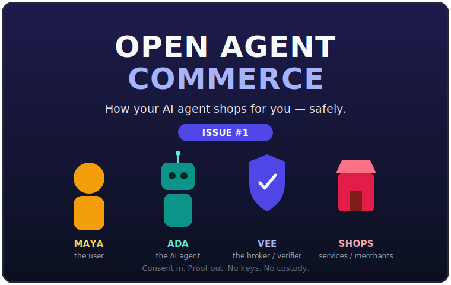
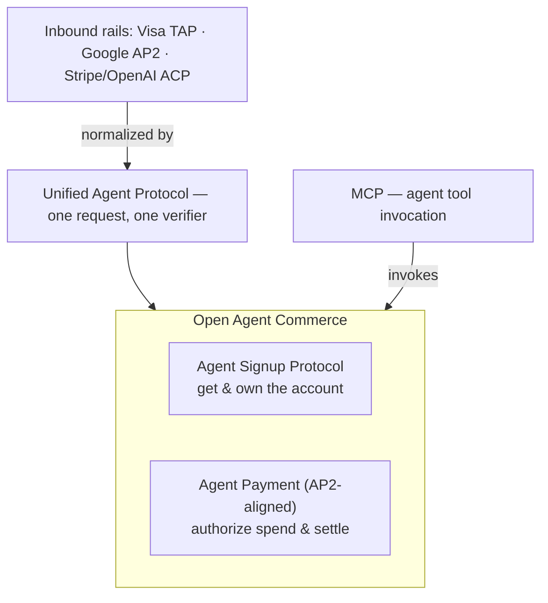
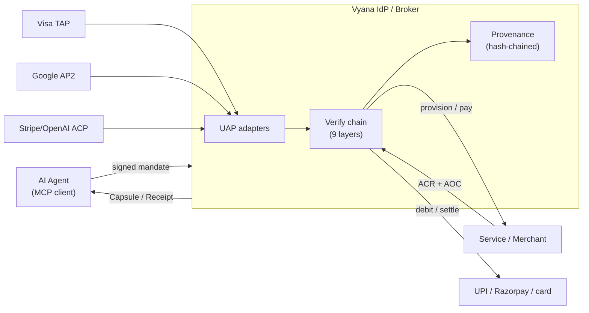

# Open Agent Commerce

> Open protocols and reference primitives that let AI agents **create accounts,
> authorize spend, receive credentials, and prove ownership** under signed,
> revocable user consent — with a tamper-evident provenance trail — and that
> **unify** the major agent-commerce rails (Visa TAP, Google AP2, Stripe/OpenAI
> ACP) behind one verification model.

[](https://github.com/vyana-dev/open-agent-commerce/actions/workflows/ci.yml)
[](./spec)
[-MIT-green)](./LICENSE-CODE)
[-CC%20BY%204.0-green)](./LICENSE-SPEC)
[](./CONTRIBUTING.md)

<p align="center">
  <a href="./docs/COMIC.md"></a>
  <br/>
  <em>📖 New to agent commerce? <a href="./docs/COMIC.md"><b>Read the comic →</b></a> &nbsp;(8 panels, no spec required)</em>
</p>

Stewarded by **Vyana** as a neutral steward — published as an open standard, not
owned (see [GOVERNANCE](./GOVERNANCE.md)). Comments, issues, and implementations
from any vendor are welcome.

**Open Agent Commerce is a suite of three components:**

| Component | What it does |
|---|---|
| **ASP** — Agent Signup Protocol | How an agent creates/connects an account and proves who owns it. |
| **Agent Payment** (AP2-aligned) | How an agent is authorized to spend, and how settlement is proven. |
| **Unified Agent Protocol** | A neutral layer that normalizes Visa TAP, Google AP2, Stripe/OpenAI ACP, and the above into one verifiable request. |

---

## Contents

- [The challenge](#the-challenge)
- [The solution](#the-solution)
- [Design goals & non-goals](#design-goals--non-goals)
- [Where this sits in the stack](#where-this-sits-in-the-stack)
- [Unified Agent Protocol](#unified-agent-protocol)
- [Interoperability status](#interoperability-status)
- [How it works](#how-it-works)
- [Core objects](#core-objects)
- [Quick start](#quick-start)
- [The one rule that makes signatures interoperate](#the-one-rule-that-makes-signatures-interoperate)
- [Repository layout](#repository-layout)
- [Conformance](#conformance)
- [Versioning & stability](#versioning--stability)
- [Standards & prior art](#standards--prior-art)
- [Implementations](#implementations)
- [Governance, community & support](#governance-community--support)
- [Citing this work](#citing-this-work)
- [License & trademarks](#license--trademarks)

---

## The challenge

AI agents are starting to transact for people: signing up for services, paying,
managing subscriptions. But there is no neutral, verifiable way to answer:

- **Did the user actually authorize this agent to do this?** (authorization)
- **Is this a real, credentialed agent — not an anonymous bot?** (authenticity)
- **What exactly happened, and can it be proven later?** (accountability)
- **When the agent signs the user up somewhere, who owns that account?** (ownership)

Payment rails (ACP, AP2, Visa TAP, UPI) move money and verify identity. None of
them defines how an agent **creates and owns an account** in the first place, nor
emits a portable, signed record of *why* an action was allowed.

## The solution

Signature-first protocols plus framework-free reference primitives:

| Component | Question it answers | Core outputs |
|---|---|---|
| **Agent Signup Protocol** | Can this agent create/connect this merchant account, and who owns it? | `CredentialCapsule`, `AccountCreationReceipt`, `AccountOwnershipCertificate` |
| **Agent Payment** (AP2-aligned) | Can this agent spend this amount here, and did settlement happen? | `CartMandate`, `Receipt` |
| **Unified Agent Protocol** | Can a verifier evaluate a TAP / AP2 / ACP / Vyana request with one engine? | `UnifiedAuthorizationRequest` |

Signup and payment are bound to one **User Consent Mandate** (revocable) and one
**provenance chain**. Signup is deliberately scoped to account creation + initial
credential issuance; ongoing payment/settlement is AP2-aligned and rail-agnostic.

## Design goals & non-goals

**Goals**

- **Neutral & rail-agnostic.** No lock-in to any payment network, wallet, or
  cloud. The same request verifies whether settlement lands on UPI, cards, or a
  token.
- **Signature-first & non-repudiable.** Every authorization is a signed object;
  every decision appends a hash-chained, exportable provenance event.
- **Non-custodial.** The protocols never require an intermediary to custody funds
  or private keys; verification and fund movement are separable concerns.
- **Interoperable across languages.** A canonical signing form + JSON Schemas +
  conformance vectors let any implementation interoperate byte-for-byte.
- **User-bounded consent.** Spend, scope, and validity are bounded by a revocable
  User Consent Mandate the user signs.
- **Minimal.** The reference implementation is framework-free with zero runtime
  dependencies.

**Non-goals**

- **Not a payment rail or PSP.** Open Agent Commerce does not move or custody
  money; it authorizes and records.
- **Not a replacement** for Visa TAP, Google AP2, Stripe/OpenAI ACP, or MCP — it
  **composes with** them (see [UAP](#unified-agent-protocol)).
- **Not a fraud/risk scoring system.** It defines verifiable structure, not an ML
  model.
- **Does not mandate a specific verifier implementation.** It defines the request
  and the obligations.

## Where this sits in the stack



The protocols are **rail-agnostic**: mandates and receipts verify the same way
whether settlement lands on UPI, cards, or a payment token. They are meant to be
*consumed alongside* TAP/AP2/ACP, not to replace them.

## Unified Agent Protocol

The agent-commerce ecosystem is fragmenting across protocols. The Unified Agent
Protocol is a **neutral normalization layer**: adapters map **Visa TAP**, **Google
AP2**, **Stripe/OpenAI ACP**, and **Vyana ASP/payment** into one canonical
`UnifiedAuthorizationRequest`, so a verifier evaluates any of them with **one
policy engine** and emits **one provenance record**.

```ts
import { fromVisaTap, fromAp2, fromAcp, fromVyana } from "@vyana/open-agent-commerce";

const req = fromVisaTap({ agentId, keyId, algorithm, signature, par, amountMinor, currency });
// → { identity, authorization, instrument, sources: ["visa-tap"], … }
// hand `req` to one verify chain, regardless of which protocol it arrived on.
```

It **does not replace or claim ownership** of TAP/AP2/ACP — those are owned by
Visa/Google/Stripe. It normalizes their *shape* and leaves *verification* (RFC
9421, VDC proofs, token validation, Ed25519) to the verifier. Spec:
[`spec/UAP-0.1.md`](./spec/UAP-0.1.md) · demo:
[`examples/unify-protocols.ts`](./examples/unify-protocols.ts).

## Interoperability status

Open Agent Commerce is **designed to interoperate with** the major agent-commerce
protocols. To be precise about what works today versus what is on the roadmap —
no overclaiming:

| Inbound protocol | Adapter | What it does today | Signature verification | Conformance vs a live implementation |
|---|---|---|---|---|
| Visa Trusted Agent Protocol | `fromVisaTap` | normalizes documented TAP concepts (RFC 9421 signature, PAR) into a Unified Authorization Request | done by the **verifier**, not the adapter | planned — [ROADMAP 0.2](./ROADMAP.md) |
| Google AP2 | `fromAp2` | normalizes Cart/Payment Mandate (Verifiable Credential) concepts | done by the verifier | planned — [ROADMAP 0.2](./ROADMAP.md) |
| Stripe/OpenAI ACP | `fromAcp` | normalizes Shared Payment Token concepts | done by the verifier | planned — [ROADMAP 0.2](./ROADMAP.md) |
| Vyana ASP / Payment | `fromVyana` | full native mapping | Ed25519 over canonical form | ✓ [conformance vectors](./conformance) |

The adapters map each protocol's **documented concepts**, not a pinned wire
schema, and they **normalize shape only** — an adapter never asserts a request is
verified (`identity.verified = false` until a verifier validates it). Field-level
conformance against each protocol's reference implementation is tracked in the
[roadmap](./ROADMAP.md). Open Agent Commerce is **not affiliated with or endorsed
by** Visa, Google, Stripe, or OpenAI (see [trademarks](#license--trademarks)).

## How it works

**New here? Read the [comic](./docs/COMIC.md)** — a one-page, story-first
explainer (in the spirit of the 2008 Google Chrome comic). For the engineering
view, the full set of sequence + architecture diagrams is in
**[`docs/SEQUENCES.md`](./docs/SEQUENCES.md)** (UCM consent · native signup ·
cold-start signup · payment + settlement · the verify chain · unified
verification · ownership recovery). Architecture at a glance:



## Core objects

| Object | What it is |
|---|---|
| **User Consent Mandate (UCM)** | Long-lived, user-signed authorization that bounds an agent: allowed categories, spend caps, validity. KYC level × authenticator tier bound the caps. |
| **Signup Mandate** | Per-signup, user-signed: *"I authorize agent X to create me an account at service Y under these conditions."* |
| **Signup Strategy** | The legitimate signup mechanisms: `native-asp`, `oauth-app`, `cli-session-reuse`, `paste-token`, `browser-automation`. The IdP picks the highest-trust one a service supports — so agents can onboard users at services that have **not** integrated the protocol. |
| **Credential Capsule** | The signup result: encrypted credentials + provenance link, plus a service-signed **ACR** (creation receipt) and **AOC** (ownership certificate) on the `native-asp` path. |
| **Account Ownership Certificate (AOC)** | The user's safety net — a direct-claim path to take over the account even if the IdP disappears. |
| **Cart Mandate** | User-signed authorization to pay a merchant (AP2-aligned). |
| **Unified Authorization Request** | The canonical request adapters produce from TAP / AP2 / ACP / Vyana for one verifier. |

Full normative definitions: [`spec/ASP-0.1.md`](./spec/ASP-0.1.md) ·
[`spec/APP-0.1.md`](./spec/APP-0.1.md) · [`spec/UAP-0.1.md`](./spec/UAP-0.1.md).
Machine-readable: [`schemas/`](./schemas).

## Quick start

```bash
# reference primitives (TypeScript, Node ≥ 22, zero runtime deps)
npm install
npm run build

# end-to-end demos + cross-language conformance vectors
npm test
```

```ts
import { signAspObject, verifyAspObject, generateDeviceKeyPair } from "@vyana/open-agent-commerce";

const { privateKeyPem, publicKeyDerBase64 } = generateDeviceKeyPair();
const mandate = { /* a SignupMandate or CartMandate */ };
mandate.signature = signAspObject(mandate, privateKeyPem); // Ed25519 over canonical form
verifyAspObject(mandate, publicKeyDerBase64);              // → true
```

## The one rule that makes signatures interoperate

A signature is Ed25519 over the **canonical form** of an object: drop the
`signature` field, then serialize with **recursively sorted keys**. Any party —
in any language — re-derives the exact signed bytes from the object alone. No
shared per-object key list required. (Reference: `signing.ts → canonicalObject`;
proven by [`conformance/`](./conformance).)

## Repository layout

```
spec/        ASP-0.1 + APP-0.1 + UAP-0.1 normative specs (CC BY 4.0)
schemas/     JSON Schema (2020-12) for each wire object + the unified request
docs/        SEQUENCES.md — architecture + sequence diagrams (Mermaid)
packages/
  open-agent-commerce/   @vyana/open-agent-commerce — TS reference primitives (MIT)
    src/uap/             Unified Agent Protocol: model + TAP/AP2/ACP/Vyana adapters
examples/    sign-and-verify · unify-protocols
conformance/ cross-language test vectors (canonical-form + signature) + runner
```

Project docs: [GOVERNANCE](./GOVERNANCE.md) · [ROADMAP](./ROADMAP.md) ·
[CONTRIBUTING](./CONTRIBUTING.md) · [SECURITY](./SECURITY.md) ·
[CODE_OF_CONDUCT](./CODE_OF_CONDUCT.md) · [CHANGELOG](./CHANGELOG.md) ·
[MAINTAINERS](./MAINTAINERS.md).

## Conformance

Other-language implementations prove compatibility against
[`conformance/vectors.json`](./conformance/vectors.json):

```bash
npm run build && node conformance/run.mjs
```

Canonical-form vectors are key-free and deterministic; signature vectors carry a
public key + Ed25519 signature to check verification and tamper-rejection. CI
runs them on every push. An implementation that passes these is **conformant** at
the wire-signature level.

## Versioning & stability

- **Protocol (wire) versions** are independent and embedded in objects
  (`asp-0.1`, `uap-0.1`). A change to any signed field or to canonicalization is
  **wire-breaking** and requires a minor bump (`asp-0.1` → `asp-0.2`); a purely
  additive optional field does not.
- **Reference library** (`@vyana/open-agent-commerce`) follows
  [SemVer](https://semver.org/). Pre-1.0, minor versions may break APIs.
- **`DRAFT` status** means the wire format may still change between `0.x`
  versions during the public RFC period. We will not silently change
  canonicalization — every wire-breaking change is called out in
  [CHANGELOG](./CHANGELOG.md) with a version bump and a migration note.
- **Path to 1.0:** see [ROADMAP](./ROADMAP.md). At `1.0` the wire format is
  frozen with a documented deprecation policy.

## Standards & prior art

Open Agent Commerce builds on, and is designed to interoperate with, existing
standards rather than reinvent them:

- **RFC 8032** Ed25519 (EdDSA) — object signatures.
- **RFC 9421** HTTP Message Signatures — consumed via the Visa TAP adapter.
- **W3C Verifiable Credentials** — consumed via the Google AP2 adapter.
- **JSON Schema 2020-12** — machine-readable object definitions.
- **ISO 4217** — currency codes; amounts are integer minor units.
- **Model Context Protocol (MCP)** — the agent tool-invocation layer beneath.
- **Agent-commerce protocols** it normalizes: Visa Trusted Agent Protocol, Google
  Agent Payments Protocol (AP2), Stripe/OpenAI Agentic Commerce Protocol (ACP).

## Implementations

| Implementation | Language | Status |
|---|---|---|
| [`@vyana/open-agent-commerce`](./packages/open-agent-commerce) | TypeScript | reference (this repo) |

Built an implementation in another language? It is conformant if it passes
[`conformance/`](./conformance). Open a PR to add it here — implementations from
any vendor are welcome.

## Governance, community & support

- **Governance** — how the standard evolves, roles, and the spec-change process:
  [GOVERNANCE.md](./GOVERNANCE.md). Maintainers: [MAINTAINERS.md](./MAINTAINERS.md).
- **Discuss** — open a [GitHub issue](https://github.com/vyana-dev/open-agent-commerce/issues);
  spec comments use the `asp-rfc-comment` label (see the issue templates).
- **Contribute** — [CONTRIBUTING.md](./CONTRIBUTING.md) and the
  [Code of Conduct](./CODE_OF_CONDUCT.md).
- **Report a vulnerability** — privately, per [SECURITY.md](./SECURITY.md). Do not
  open public issues for security reports.
- **Roadmap** — [ROADMAP.md](./ROADMAP.md).

## Citing this work

If you reference Open Agent Commerce in research or documentation, please cite it
via [`CITATION.cff`](./CITATION.cff) (GitHub renders a "Cite this repository"
button from it).

## License & trademarks

- **Specification prose** (`spec/`) — [CC BY 4.0](./LICENSE-SPEC).
- **Reference code** (`packages/`, `examples/`, `schemas/`, `conformance/`) —
  [MIT](./LICENSE-CODE).

You may implement these protocols freely, including commercially, and state that
your implementation "implements / is compatible with Open Agent Commerce." The
names **"Open Agent Commerce"** and **"Vyana"** and associated logos are
trademarks of Vyana Technologies; do not use them in ways that imply endorsement
or official status without permission. Compatibility claims backed by passing
[`conformance/`](./conformance) are always permitted.

Open Agent Commerce is an **independent project** and is **not affiliated with,
endorsed by, or sponsored by** Visa, Google, Stripe, or OpenAI. "Visa", "Trusted
Agent Protocol", "AP2 / Agent Payments Protocol", and "Agentic Commerce Protocol"
are trademarks of their respective owners; all references here are **nominative
and descriptive**, used only to describe interoperability.
