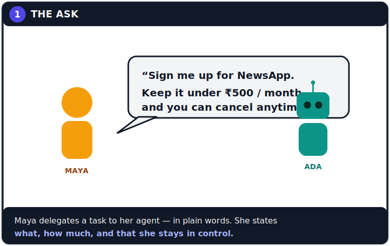
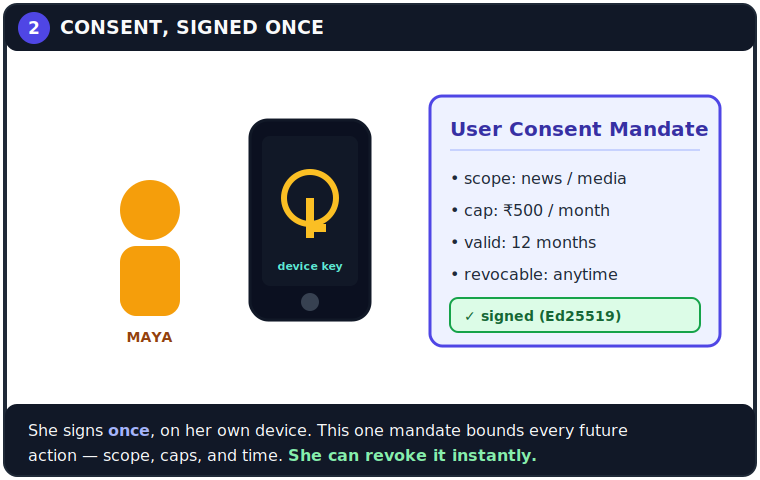
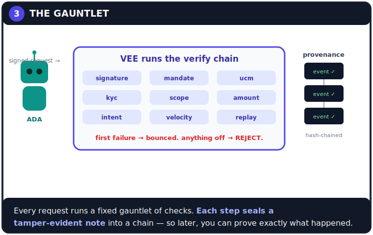
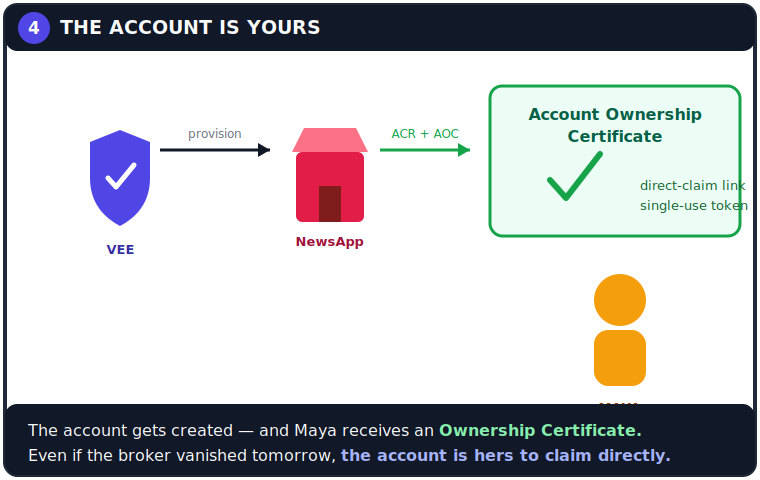
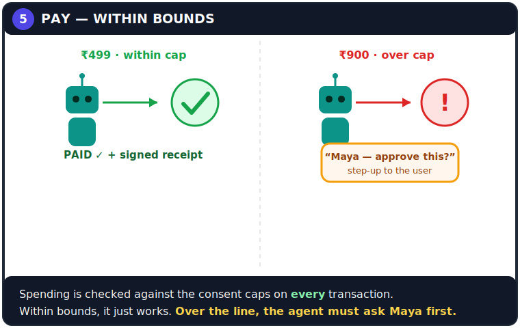
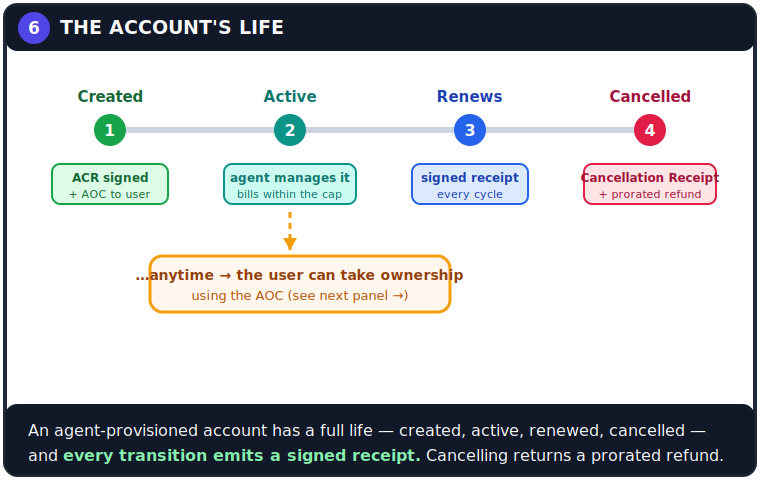
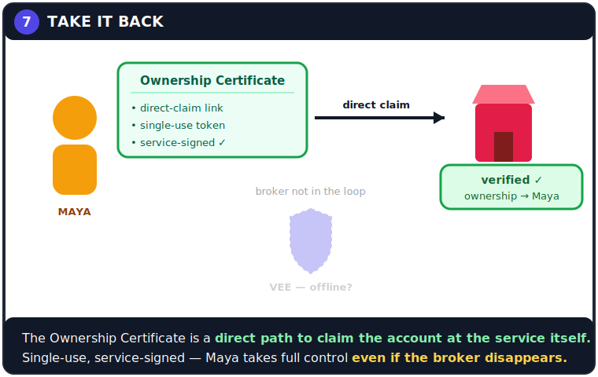
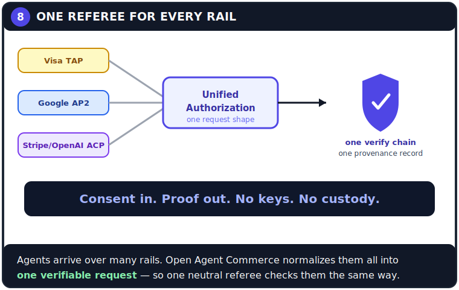

# Open Agent Commerce — the comic

> *Issue #1: “How your AI agent shops for you — safely.”*

In the tradition of the [2008 Google Chrome comic](https://www.google.com/googlebooks/chrome/)
by Scott McCloud, this is the friendly, story-first explainer for Open Agent
Commerce — the same ideas as the [spec](../spec), told as a strip you can follow
without reading a line of the spec first.

The panels are hand-authored SVG (they render right here on GitHub). The full
panel script is below, so the art can be re-illustrated or extended.

---

---

### 1 · The ask

Maya delegates a task in plain words — and states **what**, **how much**, and
that she stays in control.

### 2 · Consent, signed once

She signs **once**, on her own device. One mandate bounds every future action —
scope, caps, validity — and she can **revoke it instantly**.

### 3 · The gauntlet

Every request runs a fixed gauntlet of checks. Each step seals a
**tamper-evident note** into a chain — so later, you can prove exactly what
happened and *why*.

### 4 · The account is yours

The account is created, and Maya gets an **Ownership Certificate** (AOC) — held
in reserve. We'll see what it's for in panel 7.

### 5 · Pay — within bounds

Spending is checked against the consent caps on **every** transaction. Within
bounds it just works; over the line, the agent must **ask Maya first**.

### 6 · The account's life

An account the agent provisioned has a full **lifecycle** — created → active →
renews → cancelled — and **every transition emits a signed receipt**. The agent
manages it under consent; cancelling returns a **prorated refund**; and at any
point the user can step in and take ownership.

### 7 · Take it back

This is the safety net. The **Ownership Certificate** is a **direct-claim path**:
Maya proves ownership to the *service itself* — single-use token, service-signed
— and takes full control. **Even if the broker disappears, the account is hers.**

### 8 · One referee for every rail

Agents arrive over many rails. Open Agent Commerce normalizes them into **one
verifiable request**, so one neutral referee checks them the same way.

> **Consent in. Proof out. No keys. No custody.**

---

## The script (for illustrators)

Each panel: a setting, the **caption** (narration), and **dialogue**. Re-draw it
in any style — keep the captions, they carry the protocol.

**Cast.** *Maya* (the user). *Ada* (her AI agent — a friendly robot). *Vee* (the
broker/verifier — a shield-shaped guardian). *Shops* (services / merchants).

1. **The ask.** Maya, coffee in hand, speaks to Ada.
   *Maya:* “Sign me up for NewsApp. Keep it under ₹500/month, and you can cancel anytime.”
   *Caption:* Maya delegates a task — in plain words. She states what, how much, and that she stays in control.

2. **Consent, signed once.** Maya taps her phone; a key glows. A document — the *User Consent Mandate* — gets a green ✓.
   *Caption:* She signs once, on her own device. One mandate bounds every future action — scope, caps, time. She can revoke it instantly.

3. **The gauntlet.** Ada hands a signed request to Vee. Vee runs it through nine checks (signature → mandate → ucm → kyc → scope → amount → intent → velocity → replay). A chain of sealed notes spools out the side.
   *Vee:* “Every step gets a sealed, tamper-evident note.”
   *Caption:* First failure → bounced. Anything off → rejected. The provenance chain proves what happened.

4. **The account is yours.** Vee provisions the account at NewsApp; the shop hands back receipts. Maya holds a glowing *Account Ownership Certificate*, slipping it into her pocket for later.
   *Caption:* The account is created — and the Ownership Certificate goes to Maya, held in reserve.

5. **Pay — within bounds.** Split panel. Left: Ada pays ₹499 → green ✓ “PAID.” Right: a ₹900 charge → red “!” and a card: “Maya — approve this?”
   *Caption:* Caps are checked on every payment. Within bounds it just works; over the line, the agent asks Maya first.

6. **The account's life.** A lifecycle track: **Created** (ACR signed + AOC issued) → **Active** (agent manages it, bills within the cap) → **Renews** (a signed receipt each cycle) → **Cancelled** (a *Cancellation Receipt* + prorated refund). A dashed branch from “Active” drops down: *“…anytime → the user can take ownership.”*
   *Caption:* An agent-provisioned account has a full life, and every transition emits a signed receipt. Cancelling returns a prorated refund.

7. **Take it back.** Vee is faded and grey — “offline?” — off to the side. Maya, holding the *Ownership Certificate* (direct-claim link · single-use token · service-signed), walks a bold straight line **past** Vee to NewsApp. The shop checks it (✓) and hands her the account.
   *Maya (calm):* “I'll take it from here.”
   *Caption:* The Ownership Certificate is a direct path to claim the account at the service itself. Single-use, service-signed — Maya takes full control even if the broker disappears.

8. **One referee for every rail.** Three labeled rails (Visa TAP, Google AP2, Stripe/OpenAI ACP) funnel into one “Unified Authorization” request → one shield (one verify chain, one provenance record).
   *Caption:* Many rails in, one verifiable request out — one neutral referee checks them all the same way.
   *Banner:* Consent in. Proof out. No keys. No custody.

---

## Read on

- The specs: [ASP](../spec/ASP-0.1.md) · [Agent Payment](../spec/APP-0.1.md) · [Unified Agent Protocol](../spec/UAP-0.1.md)
- Account lifecycle & ownership objects: `AccountCreationReceipt`, `AccountOwnershipCertificate`, `CancellationReceipt` — see [`../schemas`](../schemas) and the [primitives](../packages/open-agent-commerce/src/objects.ts).
- The mechanics, as engineering diagrams: [SEQUENCES.md](./SEQUENCES.md) (incl. the ownership-recovery flow).
- Try it: [`../examples`](../examples) · prove interop: [`../conformance`](../conformance)

*Art and script: CC BY 4.0, like the rest of the spec prose. Remix it, translate
it, make it yours.*

*Brand names (Visa TAP, Google AP2, Stripe/OpenAI ACP) are used descriptively.
Open Agent Commerce is an independent project, not affiliated with or endorsed by
Visa, Google, Stripe, or OpenAI.*
