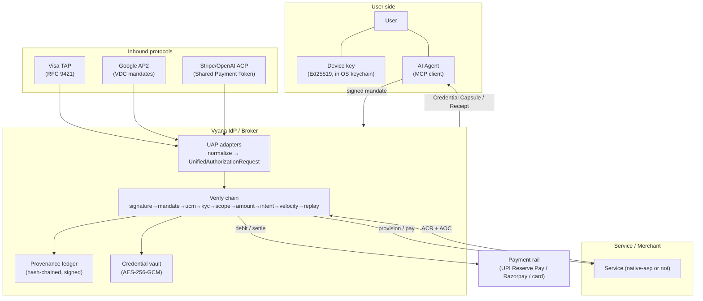
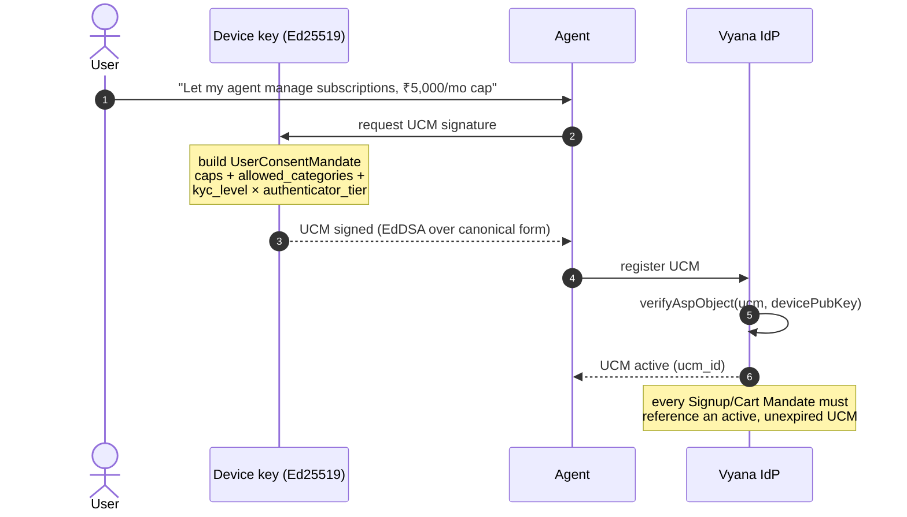
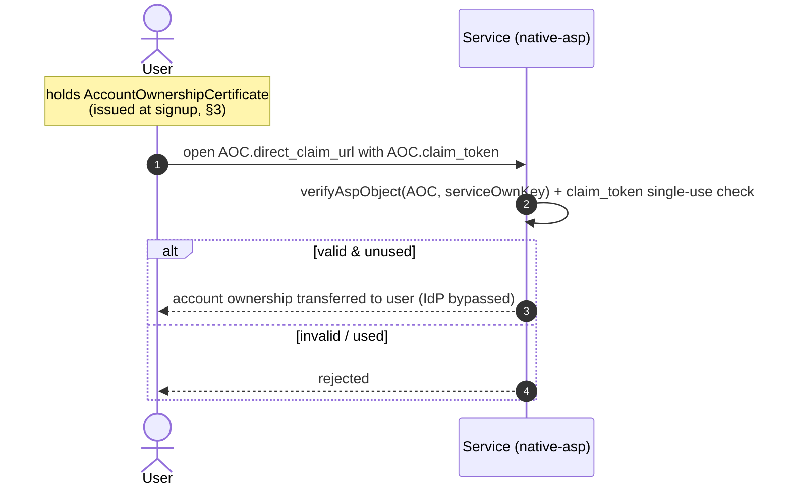

# Sequence & architecture diagrams

Detailed flows for ASP (signup), APP (payment), and UAP (unified verification).
Diagrams are [Mermaid](https://mermaid.js.org/) and render natively on GitHub.

Contents:
1. [System architecture](#1-system-architecture)
2. [Issuing a User Consent Mandate (UCM)](#2-issuing-a-user-consent-mandate-ucm)
3. [ASP — native-asp signup](#3-asp--native-asp-signup-integrated-service)
4. [ASP — non-integrated service (cold-start path)](#4-asp--non-integrated-service-cold-start-path)
5. [APP — payment + settlement](#5-app--payment--settlement)
6. [The verify chain](#6-the-verify-chain)
7. [UAP — unified verification across TAP / AP2 / ACP / Vyana](#7-uap--unified-verification)
8. [Account ownership recovery (AOC)](#8-account-ownership-recovery-aoc)

---

## 1. System architecture



Vyana never custodies funds: the verify chain instructs the rail (which holds
funds) and verifies captures. See the regulatory note in the project README.

---

## 2. Issuing a User Consent Mandate (UCM)

The long-lived, user-signed authorization that bounds every later action.



---

## 3. ASP — native-asp signup (integrated Service)

Highest-trust path: the Service implements ASP and returns ownership proofs.

```mermaid
sequenceDiagram
    autonumber
    actor U as User
    participant AG as Agent
    participant IDP as Vyana IdP
    participant SVC as Service (native-asp)

    U->>AG: "sign me up for Pro on example.com"
    AG->>AG: build SignupMandate (scoped to UCM)
    AG->>IDP: POST /v1/signup (signed SignupMandate)
    IDP->>IDP: verify chain (signature→…→replay)
    Note over IDP: each layer appends a provenance event
    alt any layer fails
        IDP-->>AG: 4xx + provenance reason
    else all pass
        IDP->>IDP: mint SignupIntentToken (SIT, broker-signed, ≤5 min)
        IDP->>SVC: create account (SIT)
        SVC->>SVC: verifyAspObject(SIT, brokerPubKey)
        SVC-->>IDP: AccountCreationReceipt (ACR) + AccountOwnershipCertificate (AOC)
        IDP->>IDP: encrypt credentials → vault; close provenance chain
        IDP-->>AG: CredentialCapsule (creds + ACR + AOC + provenance head)
        AG-->>U: account ready
    end
```

---

## 4. ASP — non-integrated Service (cold-start path)

The unlock for adoption: agents onboard users at Services that have **not**
integrated ASP, via a lower-trust strategy (`oauth-app`, `paste-token`,
`browser-automation`). No ACR/AOC, but still under signed consent + provenance.

```mermaid
sequenceDiagram
    autonumber
    actor U as User
    participant AG as Agent
    participant IDP as Vyana IdP
    participant SVC as Service (no ASP)

    U->>AG: "create me an account on legacy-shop.com"
    AG->>IDP: POST /v1/signup (SignupMandate, allowed_strategies)
    IDP->>IDP: verify chain + pick highest-trust strategy Service supports
    Note over IDP: native-asp unavailable →<br/>fall back to browser-automation / oauth-app
    IDP->>SVC: drive signup (automation / OAuth app install)
    SVC-->>IDP: account created (no ACR/AOC)
    IDP->>IDP: capture credentials → vault; provenance event "strategy=browser-automation"
    IDP-->>AG: CredentialCapsule (tos_class B/C, no ownership cert)
    Note over IDP,SVC: value delivered with ZERO Service integration —<br/>volume later pulls the Service to adopt native-asp
```

---

## 5. APP — payment + settlement

```mermaid
sequenceDiagram
    autonumber
    actor U as User
    participant AG as Agent
    participant IDP as Vyana IdP
    participant RAIL as Payment rail (UPI / Razorpay)
    participant SVC as Merchant

    U->>AG: "pay ₹499 for the Pro plan"
    AG->>AG: build CartMandate (line_items, amount_paise)
    AG->>IDP: POST /v1/app/checkout (signed CartMandate)
    IDP->>IDP: verify chain (incl. amount caps vs UCM, velocity, replay)
    alt within consent + caps
        IDP->>RAIL: create order / payment link / autopay debit
        RAIL-->>IDP: payment intent
        RAIL->>RAIL: capture (UPI Reserve Pay block debit)
        RAIL-->>IDP: payment.captured (webhook)
        IDP->>RAIL: settle merchant share (Route / payout)
        IDP->>IDP: write provenance; mint Receipt (broker-signed)
        IDP-->>AG: Receipt (delivered)
        AG-->>U: paid ✓
    else exceeds caps / no consent
        IDP-->>AG: awaiting_approval or rejected (+ provenance)
        AG->>U: step-up approval needed
    end
```

---

## 6. The verify chain

Fixed, non-configurable order. First failure short-circuits; every layer appends
a hash-chained provenance event.

```mermaid
sequenceDiagram
    autonumber
    participant REQ as Request (UAR or signed mandate)
    participant VC as Verify chain
    participant PROV as Provenance ledger

    REQ->>VC: evaluate
    loop each layer, in fixed order
        Note over VC: signature → mandate → ucm → kyc →<br/>scope → amount → intent → velocity → replay
        VC->>PROV: append event {step, result, prevHash, thisHash}
        alt layer fails
            VC-->>REQ: REJECT (provenance head returned)
        end
    end
    VC-->>REQ: ALLOW (provenance head returned)
    Note over PROV: chain is tamper-evident;<br/>broker-signed when signing key present
```

---

## 7. UAP — unified verification

One canonical request, one verify chain, regardless of inbound protocol.

```mermaid
sequenceDiagram
    autonumber
    participant SRC as Agent (via TAP / AP2 / ACP / Vyana)
    participant ADP as UAP adapter
    participant VC as Verify chain
    participant PROV as Provenance ledger
    participant RAIL as Rail / Service

    SRC->>ADP: protocol-native request
    Note over ADP: fromVisaTap / fromAp2 / fromAcp / fromVyana
    ADP-->>VC: UnifiedAuthorizationRequest (identity + authorization + instrument)
    Note over ADP,VC: adapter normalizes SHAPE only;<br/>identity.verified = false
    VC->>VC: validate attestation for identity.attestation.kind<br/>(RFC 9421 / VDC / token / Ed25519) → set verified
    VC->>VC: enforce scope + amount limits
    VC->>PROV: hash-chained provenance per step
    alt verified & within policy
        VC->>RAIL: authorize on the instrument's rail
        VC-->>SRC: ALLOW + provenance head
    else
        VC-->>SRC: DENY + provenance head
    end
```

---

## 8. Account ownership recovery (AOC)

The user's safety net: a direct claim path that works even if the IdP disappears.


